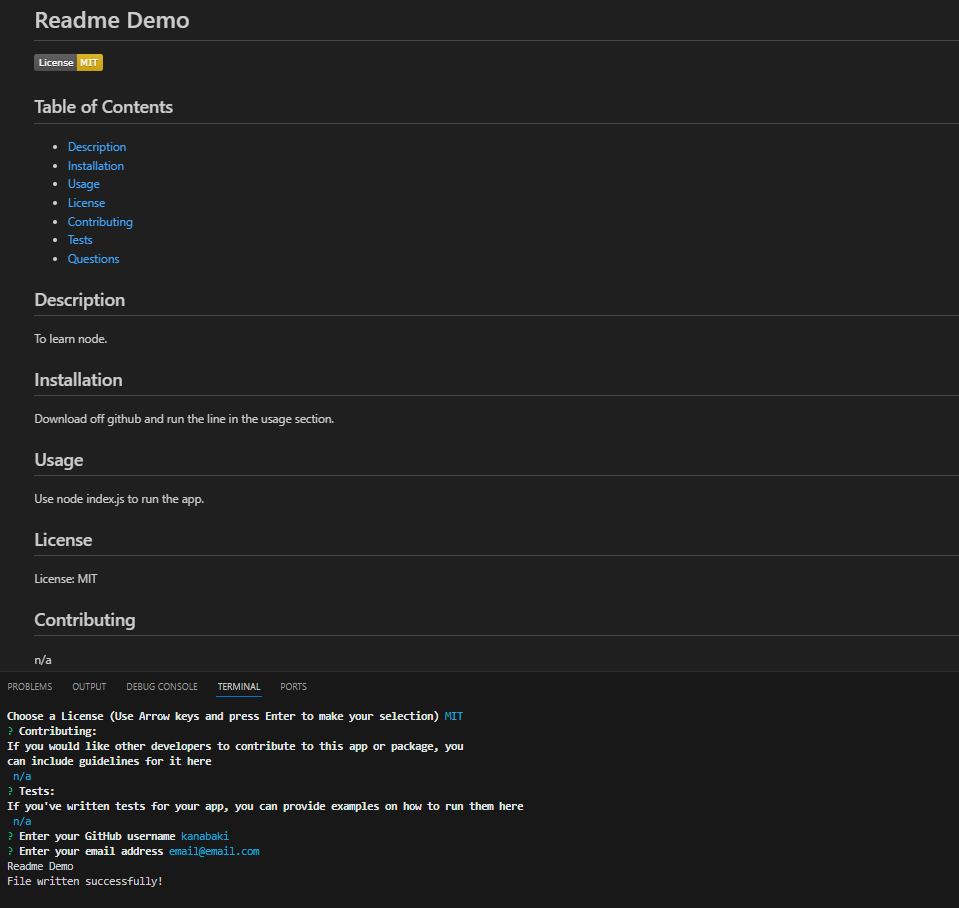

# Professional README Generator 

  ## Table of Contents
- [Description](#description)
- [Installation](#installation)
- [Usage](#usage)
- [Credits](#credits)
- [License](#license)
- [Contributing](#contributing)
- [Tests](#tests)
- [Questions](#questions)

## Description 
This project was with learning node in mind, and to spend less time coding readme's.
The project cuts down time writing and rendering a readme so more time can be spent
coding elsewhere. The node terminal was explored in the process of writing this app,
as well as learning how to import and export files and npm modules. Inquirer was also learned to facilitate the collection of user input.

## Installation
All that is needed to run is the line that's explained in the usage section below. If the app will not run and you get an error,make sure you have the node modules in your local machine using the line **npm install** .

## Usage
Usage Image:

Open up your terminal and make sure you are in the correct file directory for this project. Then run the line **node index.js** to get node to search the file and execute the code. Once node finishes loading, you will get a series of prompts. Answer the prompts, and once there are no more prompts you will be notified of the prompt completion in the terminal. A readme file will be generated for you to use. 

Link to Demo Video: https://drive.google.com/file/d/1_9dwf9tgONBdDiYVWqIkFtXcAFkkQcke/view?usp=drive_link

## Credits
Original Starter code from: https://github.com/coding-boot-camp/potential-enigma

## License
License: MIT

## Contributing 
Go to the Questions section for more info.

## Tests 
No tests at this time.

## Questions 
If you have questions regarding the app, you can reach out to my github or email.

GitHub: https://github.com/Kanabaki

Email: kagomekanabaki@gmail.com

-Note- Some code was developed under tutor Hardemon, Andrew; includes the .then method of the init function in index.js and guided the rendering of the License section functions in generateMarkdown.js. -Note-